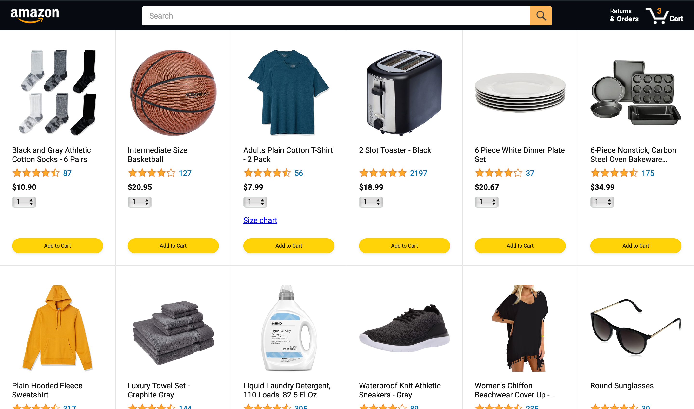
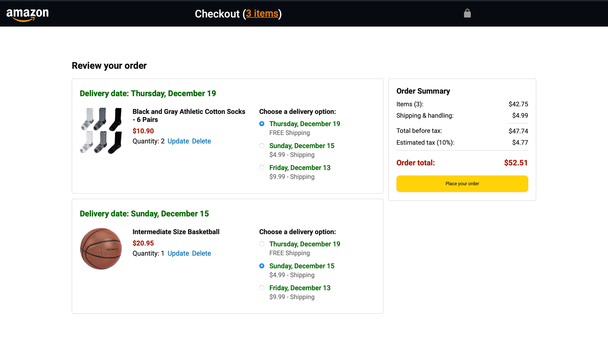
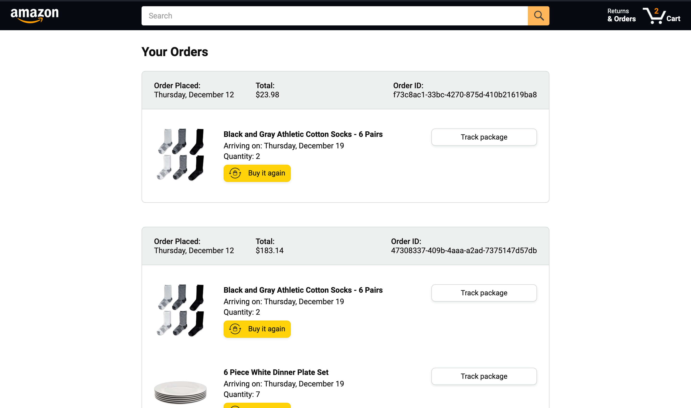
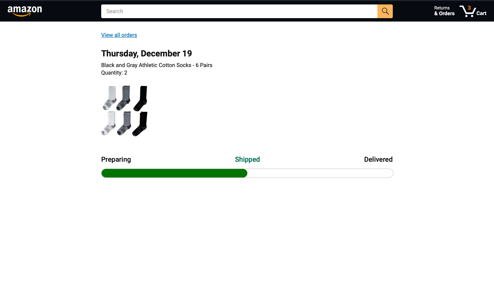

# JavaScript Amazon Project


 


This project is a simplified version of the Amazon website, developed using vanilla JavaScript, HTML, and CSS. It replicates core e-commerce functionalities, providing a solid foundation for understanding web development concepts.

## Features

- **Product Browsing**: View a selection of products with images, names, ratings, prices, and quantity options.
- **Search Functionality**: Search for products with an interactive dropdown displaying matching items.
- **Shopping Cart**: Add products to the cart with specified quantities and view the total items in the cart.
- **Order Management**: View past orders with details like order date, total, products ordered, and tracking options.
- **Responsive Design**: Optimized for various screen sizes, including desktops, tablets, and mobile devices.

## Technologies Used

- **Frontend**: HTML, CSS, JavaScript (Vanilla)
- **Version Control**: Git and GitHub

## Installation

1. **Clone the Repository**:

   ```bash
   git clone https://github.com/ZingZing001/javascript-amazon-project.git
   ```

2. **Open the Application**:
   - Open `index.html` in your preferred IDE.

## Usage

- **Browse Products**: Scroll through the product listings on the main page.
- **Search Products**: Use the search bar to find products; matching items will appear in a dropdown.
- **Add to Cart**: Select the desired quantity and click "Add to Cart" to add products.
- **View Cart**: Click on the cart icon in the header to view items in your cart.
- **Manage Orders**: Navigate to the "Orders" page to view past orders and track packages.

## Screenshots


*Home Page*


*Cart Page*


*Orders Page*


*Tracking Page*
## Contributing

Contributions are welcome! Please follow these steps:

1. **Fork the Repository**: Click the "Fork" button at the top right of this page.
2. **Clone Your Fork**:

   ```bash
   git clone https://github.com/your-username/javascript-amazon-project.git
   ```

3. **Create a Branch**:

   ```bash
   git checkout -b feature/YourFeatureName
   ```

4. **Make Your Changes**: Implement your feature or bug fix.
5. **Commit Your Changes**:

   ```bash
   git commit -m 'Add feature: YourFeatureName'
   ```

6. **Push to Your Fork**:

   ```bash
   git push origin feature/YourFeatureName
   ```

7. **Submit a Pull Request**: Navigate to the original repository and click "New Pull Request."

## License

This project is licensed under the MIT License. See the [LICENSE](LICENSE) file for details.

## Acknowledgements

This project was inspired by the "JavaScript from Beginner to Pro" tutorial by SuperSimpleDev.

## Contact

For questions or suggestions, please contact [ZingZing001](https://github.com/ZingZing001).
